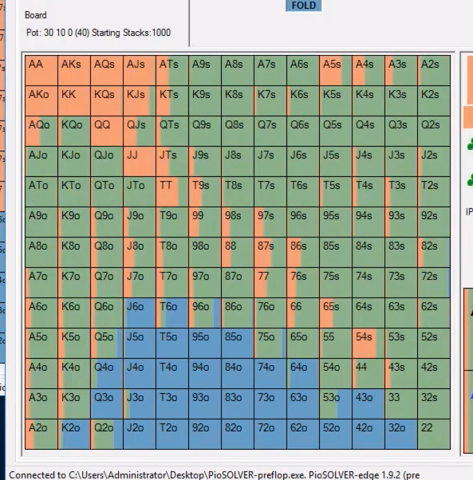
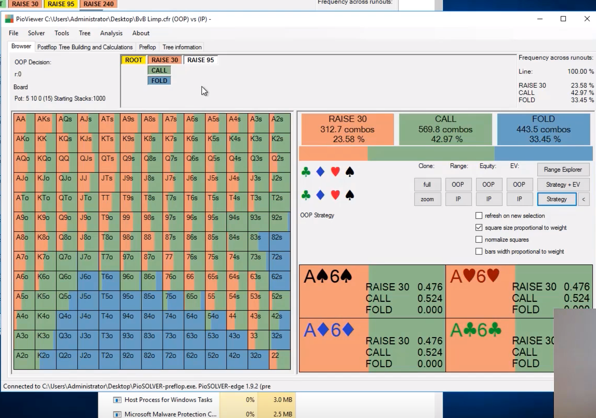
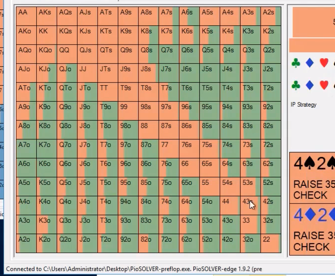
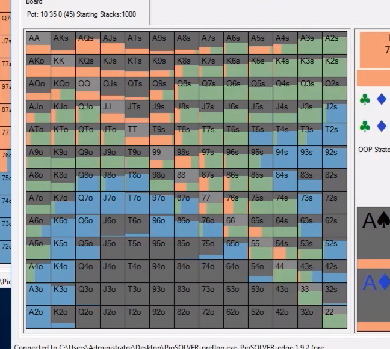

- for bb, notice the bluffs are A5s, A6s, K5s-K7s, J8 and J9o, 54-T9s, 86s, and 97s, J2-J4s.
- for bb, 3 bet value are AQo+, ATs+, KTs half the time, 99+.
- for bb, calls any suited at least,
- if SB limps at all, BB should be 3 betting less since SB is a bit more polarized and SB's raising range has more stronger hands and will be 4 betting more.

SB range:

- sb opening more of the suited hands. QTs more of a open then QTo.
- sb limps bottom of their range like A2o, K4o, T2s, 92s, 83s, 65o, 96o. limp/folding. Balance with limp/calling J8s, Q8s, T7s, QJo, QTo, A6s, K8s, AJs and AQs, ATo and A9o.

- notice BB checks A5-A7o, raises, A2-A4o, checks sometimes with A6-A7s.raises J8s and 96s and A8o+. checks behind middle hands like T9o, J6s, Q8o.
- if opponent is limp-raising a lot, don't raise hands maybe like T7s which is punished by it. Maybe raise less and 3 bet more because if opponent is limp-raising a lot of good hands, his raises are weaker.

- notice sb can limp reraise 67s, 88, T8s, J9s, Q9s. It's kind of like the SB 3 bet range OOP. some A4-A8s.
- sb folding A2o-A5o, J2s, 94s, 52s, T8o, 97o, Q8o.
- sb calling with J5s, any suited Queens or King or Ace, 22-66, K8o, A7o, K8s, T7s.
- sb mixing with T8s, 98s, 97s, 86s, Q8s, A7s, AJo, KQo.
