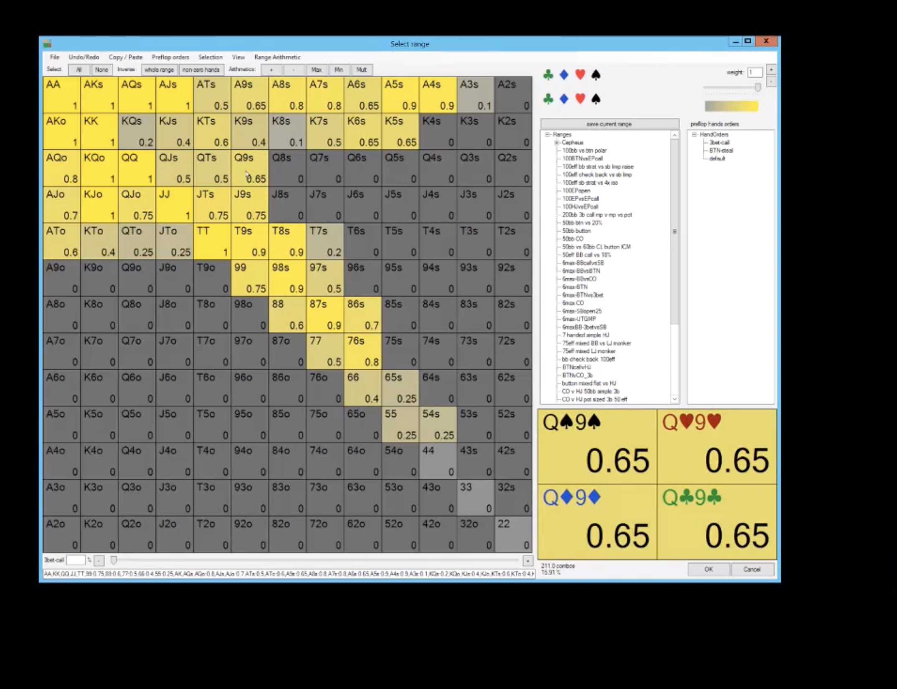
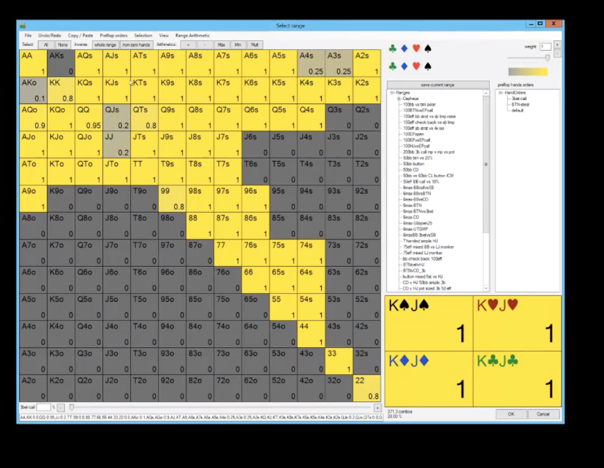

**SB vs BTN**

SB range:

- sb 3 betting ATo fairly aggressively, KQs not that much, KQo all the time, ATs less aggressively than ATo. Q9s and J9s are good 3 bets. 76-98ss are 3 bets almost always. K5-KTs are 3 bets. 65s and 54s are 3 bets sometimes. 55-66 are 3 bets sometimes.

BTN call range:

- flat AA, 4 bet KK only sometimes, calls 80%. QQ calls 90%. JJ 4 bets always.  QJs 4 bets a lot and QTs. AA blocks AK and has 0 protection issues. AK 4 betting always A4 and A3 are good 4 bets.

Theory:
- block bets are mostly OOP play. IP doesn't do much block betting, can just check.

**KQJr**
- SB ahd high equity.
- AA and AK can bet because we have so many good hands. IP has a lot of lower pair and some nothing and are fairly wide.  
- Hands like 65s and 87ss with BDFD can bet big with the intention to barrel off.
- If opponent has hands like K2s and J7s and Q8s, AA is a pot bet.
- people probably aren't betting A3ss with just a gutter in real life so we can exploit this by playing tighter IP and since most poeple are tigheter, we can bet thse hands as bluffs.
- OOP can bluff with 55-77 because it doesn't interact with the call/call range.
- OOP can check with J9 and Q9 and K9s.

vs a big OOP bet:
- IP should be folding most queens. except for AQ. Even some Kings should fold like K8 and K9hh. K9cc is calling only sometimes which is surprising. Can't be too wide on the turn. K3ss with a BDFD and doesn't interact with bluffs is a call.

** KQJr, bet call**
- oOP should check 9 and A because IP has so many tens like T7s and QTss.
- OOP can bomb 2-8 on turn.
- Oop can bet a T turn which helps our equity more than IP. IP can't call flop with many aces.