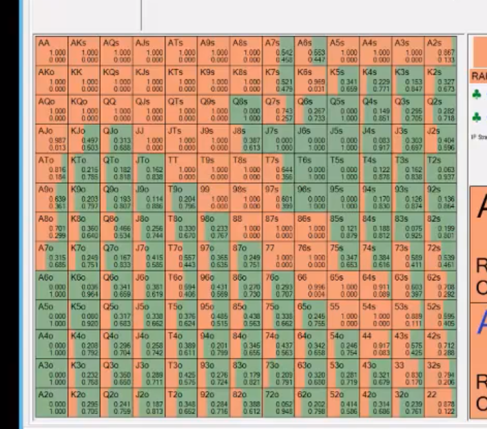
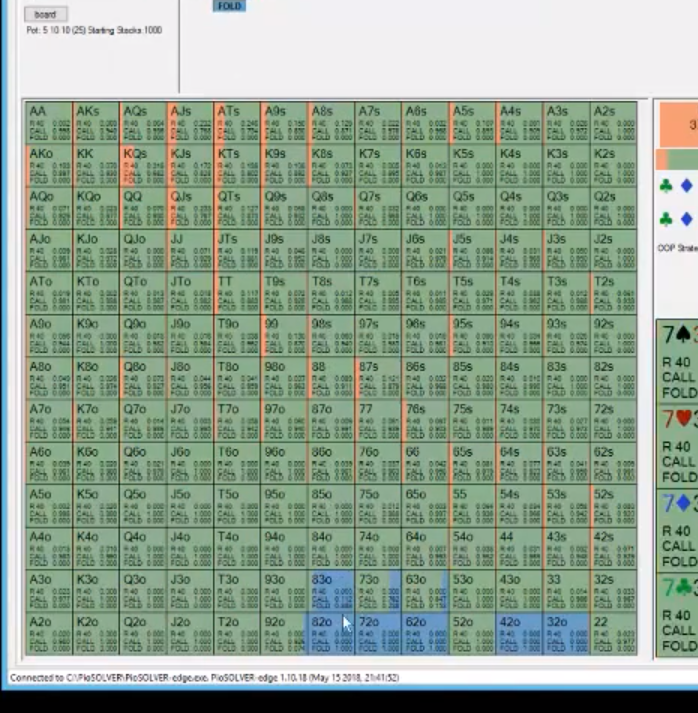
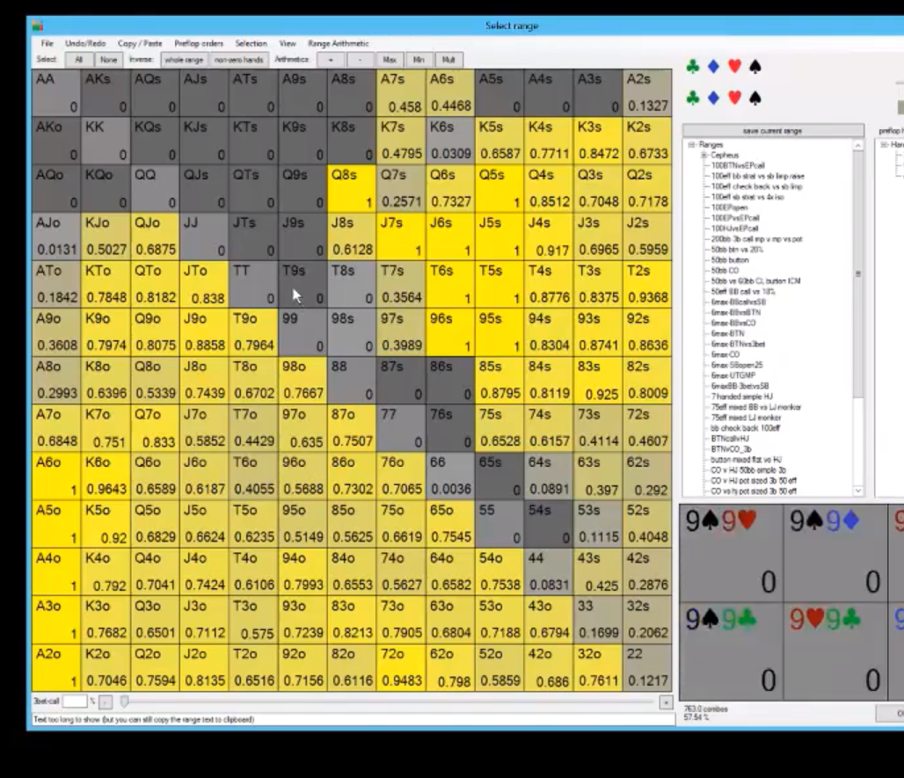
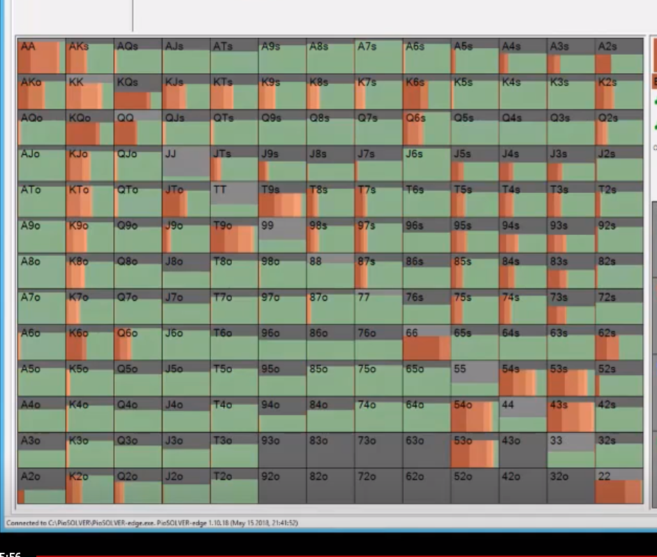

BB raising range when SB calls:

- A7+ but A8o is better, any suited ace, K6s+, Q7s+, J8s+, 42s+ up to 97s and above, 32s+, any pair, and Q8o sometimes, K8o sometimes.
- 40% of hands is ideal but rarely do people achieve this because randomizing is hard with the T4o.

so this is IP range postflop:

- if BB does not raise, the above is the BB range.
- since IP is raising a lot preflop those big bways and suited connectors, that means SB can bet those flops if there is an A and SB has everything because SB calls everything preflop.
- BB doesn't have any pairs really because raises most of them.
- BB doesn't have big bways or Q9s or J9s or K6s or any suited aces.

**QsTs9d flop**
- SB is only 55% euqity so close implying that SB cannot bet big with many hands.
- SB does some big betting wit the OESD.
- BB can raise with bare J. K8o has a double blocker too.
- since BB can have a lot of cards and is checking back any two, any turn card can make two pair. So equities are close to 50% so SB does a lot of small betting on turn too.
- proportionally, SB just doesn't have that many big hands so can't put a ton of money in the pot.
- don't be fooled by SB bway advantage... SB has too many bad hands to bet big here.
- when equity runs close, slow down by betting smaller.

**KdQd6s 100bb**
- OOP limps heavily from SB, 90% vpip, but really should be tighter because BB has better hands once it's folded. maybe 80%. all suited.
- IP raises 40% hands. any suited ace, any pair really,  any two suited connector,  most bways maybe not Q9o, JTo to keep in worse queens and jacks. raise Q8o more. JTs raises always but not JTo. Q8o, J8o, T7o raise often.
- on KdQd6s, OOP has 55% equity. has all the kings and queens. we have more equity on this flop becuase the Ka nd Q are higher cards and IP is raising most of them. SB has greater equity here at 55% so use strong hands to bet bigger. still can't bet big. ther eare a lot of high equity hands, but not that low equity hands. since IP can play better when board changes, another reason for OOP to bet smaller.
- on BVB, a 2 turn card, bb can have everything so you don't really have visiblity on runouts. BB can still have two pair with 22 so you can't bet big on turns really.
- sb: 11% range is TP, 11% 2nd pair, 12.5% third pair, third pair 12%, nothing 45%, A high 14%. A high and nothing is slightly under 60%. SB has flush draws 5% of the time.
- **bb range is more condensed which means his ratio stays the same. has the same amount of pairs and nothing a bit ore than us. Fewer hands to start with but the ratio is the same of good hands.**
- BB is not raising the flop with much else besides some top piar, and bottom pair with the BDFD A high.
- SB/IP checking 82ss without a draw. 82ss with the BDFD is betting. SB checking al ot of weak kings and queens, TT and JJ, and trash. super wide cbetting though still. 85ss with the BDFD and FD are betting a lot. all the 75ss are betting, even without the BDFD. 94ss is checking without a draw. SB betting 72ss with the FD or BDFD, checking the others. J9o also betting frequently. By betting you leverage your positive equity distribution.
- BB play, surprisingly A2o with no BDFD is a call vs 1/3 pot cbet. worst jacks are folding but Jd2 are calling even with the 2d. Jd7 is a pure continue, T5o is folding without a diamond but Td is a pure call. 75o is a pure continue but 74o you need a diamond. 74o isa pure call... the point is by calling you condense your range so OOP can't barrel often. J5ss with a BDFD is a pure continue. 87o vs a light 1/3 pot cbet is a call or raise too with a diamond and BDFD, same with 75o with a BDFD. Interestly, Ad6 with a BDFD is a raise.
- interestingly, if SB bluffs flop with a FD or BDFD, it's not a good bluff again on turn sometimes because we want them to hvae hands that fold like the BDFD.
- I Think since BB typically isn't going to clal with Jd high or Td high, it prob means we can exploitably cbet these KdQd6s flops a lot for a small amount.
- once OOP/SB bets flop, checks like 80% turn because prob because SB bets so often widely and BB calls with a tighter range so SB's equity goes below 50%. Lots of yellow, so small bets.

this is SB turn betting range once BB calls a 1/3 pot bet:

- **sb turn bluffs**:
  - 97dd is a big bet, so is, T9o is good because it has equity and blocks KT and K9, JT with any diamond is good because it blocks diamonds which would call again, 53ss,
  - 92dd is a check with a pair and FD strangely.
  - giveups are NPND, 97hh with no BDFD is a check and give up. T8cc with no BDFD. weak 6s
  - weak kings can c/c turn.
  - SB turn value betting big with AA, AK, twopair+, AK with a diamond is a bigger bet because it has more equity (opponent doesn'thave flush draws and won't make them as often), smaller sizing with KT and K9 with weaker kings and aren't worth that much of the pot so the bet is smaller,

**- SB doesn't get to do much big betting because:**
  - equities run close
  - range isn't polarized
  - SB has lots of medium equity hands like mid pair and weak top pair with weak kicker, and not a lot of really low equity hands like small pairs proportional to their range.

