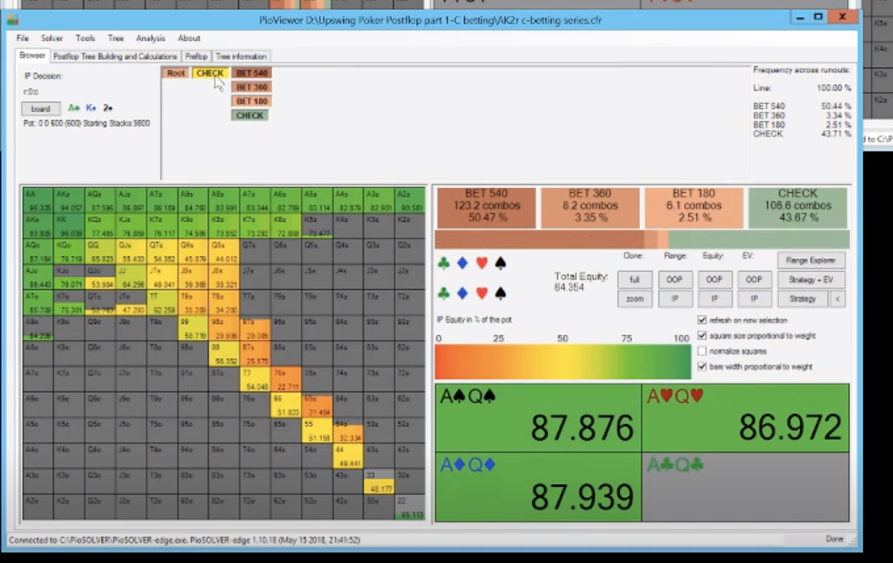
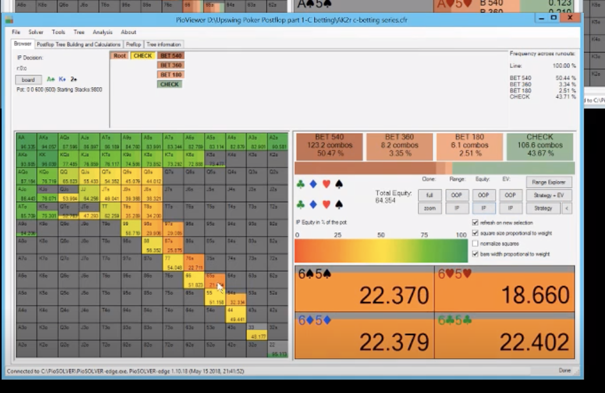
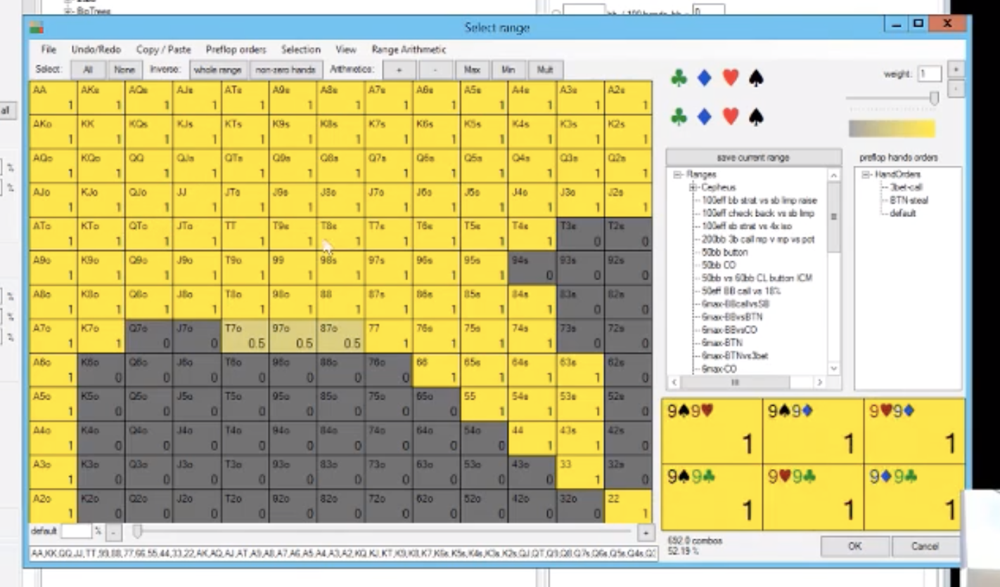
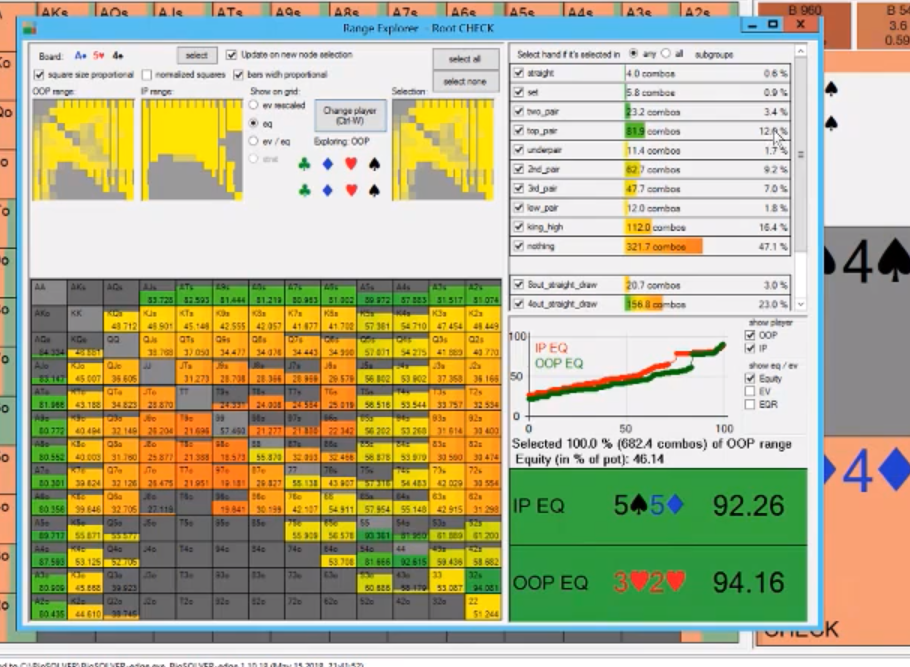

**BB vs LJ 100bb**

- vs LJ and 22%, AKo is in the range quite a bit, AKs is mostly a 3 bet. QQ 3 bets half the time
- biggest 3 bets for BB is QJs, JTs, then QTs, T9s, 87s, J9s, Q9s, 76s, then 65s, T8s, Q8s
- BB can have nutted hands on these A high boards with AQ and AK. not 3 betting AQ that much.

**BB vs LJ 100bb AJc4c**
- LJ equity is 65% and should bet 90% a lot. The high equity advantage leads to polarized large bets: lots of big betting with a big hands and air like 66. Taking advantage of BB weak range and our range is fairly strong given the 65% equity.
- However LJ can also do some small betting with QQ-KK to get vlaue from a jack.
- the air here can make J7 fold with big bets. The big bway cards allow us to bet with 66-88 with a club especially because our range is so strong. IF we bet big and get called, big bway cards like Q allows us to bet 66-88 especially with a club.
- another reason to bet small is with the jacks, there is value for protection here and betting small to protect vs Kx and Qx defends. however on teh AK4r board, KQ is a check a lot of the time.

**BB vs LJ 100bb AcKd2s**
-same equity but not the same reason to bet small with KK and QQ sdo no reason to build a smaller bet. this board supports a more polarized bet sizes, either check or bet big.
-same equity as above board.

- since there isn't value for protection KQ and KJ, we can push our equity with KQ adn KJ and check the weaker ones. We bet big with KQ with a BDFD.
- this is a good flop for big betting and checking because if you do bet big and bluff out second pair, it's gonna be donw with hands that have low equity and you have a lot of them here like 55-88 so if you have a lot of hands with low equity and high equity, it supports big betting generally. What to look for is a high equity gap between your hands and the BB hands.
- 87s is a good hand to bet big with because it has such low equity:

- we don't need small bets because:
  - no protection needed with Kings.
  - no flush draw so hands from BB like KT can't call with a pair + BDFD.

**BB vs LJ 100bb Ac5h4s**
- KQs ia  check here because it just bets better hand sto fold. Better used for a delay cbet when a bway comes. Vs good opponents, they might c/r you off with their defend range which consists of 73s or something. we don't want them to steal equity.
- 67s on AcKd2s is the same as KQs here on this board.
- the takeaway here is only cbet with hands that can barrel. KQ is a bet on the flop of AJ4 because it can barrel most turns like an 8 (an overbet) or a 2. KQ on A54 can only barrel with a BDFD comes or a J or T comes.

**Summary of LJ vs BB**
- AJc4c has a variety of small betting and big betting. small betting with KK and QQ and KJ and various weak aces.
- AcKd2s polarzied big betting and small betting.

Lets see how that changes when LJ is now the BTN:

**BTN vs BB 100bb AJc4c**
- 53% btn raise. no 67o or A2o or 87o or T8o. Not all the suited. Maybe vs olds you can.

**BTN vs BB 100bb Ac5h4s**
look at the equity and see how close it runs:

- no big betting at all. Why?
- equity wise, a lot closer. just 54%. we just have a lot more low equity hands.
- BTN just has so many more aces that it doesn't make sense to bet big with all of them iN order to get value, makes sense to bet small. BTN can bet with the BDFD aces and can call a c/r vs people. Maybe vs weaker competition, better to check the BDFD aces. CAn also bluff small with T9o which block the BB aces. Since our mid pocket pairs are smaller part of BB range, less of an incentive to build strong check back range with the suited aces like in LJ. In BTN, can bet more of the suited aces. The offsuit aces you can check back the flop with vs people who do a lot of c/r because they can't continue as well as the suited aces.
- BB is c/ring with hands like J2s and Q3s with a BDFD. Interestingly, for BB K3ss is a BDFD is a call, but Q3ss is a c/r with the BDFD. K4 with bottom pair and a BDFD is a c/r.

- Whein LJ, 26% of range is top pair, 20% underpair, 20% king high on Ac5h4s. almost 40% is underpair or king high so a large need to protect by checking. build a strong check range with the A2-a6s in our range that can comfortably call a bet when a 6 rolls off on the turn.
- When BTN, only underpair and king high is only 25% of range so less a need to build a strong check back range.
- I think the big takeaway is that the BTN range has so many more aces, you can bet more air and K high and 99-KK are less of a proportion of BTN range so you don't need to build strong checks to protect them so BTN can bet more A2-A7ss with a BDFD.

**BTN vs BB 100bb AK2**
- we have more weak aces so we bet smaller to extract value from weaker kings and q high. As our equity is less of a hammer lockand we have more weak hands, we generally need to bet smaller to try to extract value from hands that are slightly behind.
- BTN has to do this more than teh LJ because LJ just doesn't have that many weak aces (none of the offsuit aces) and very few kings.