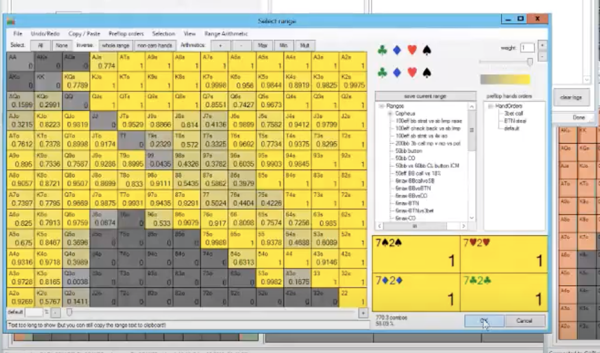
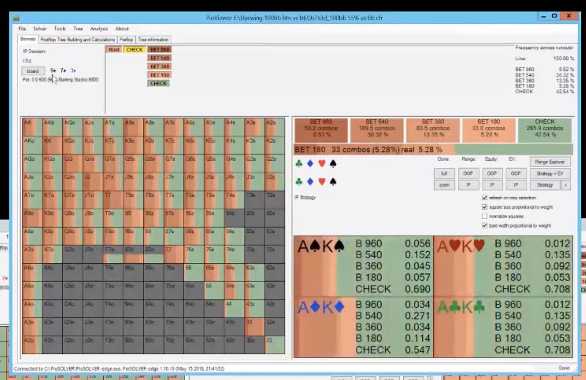
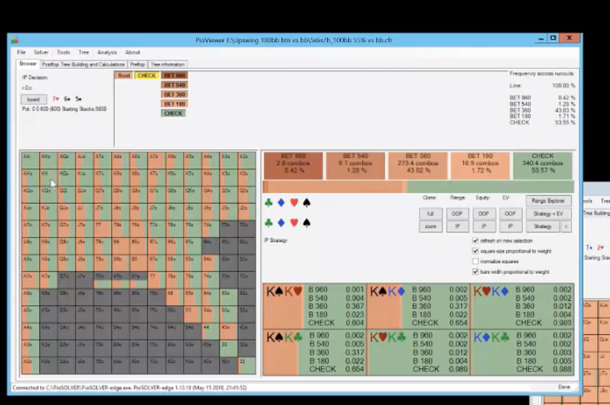
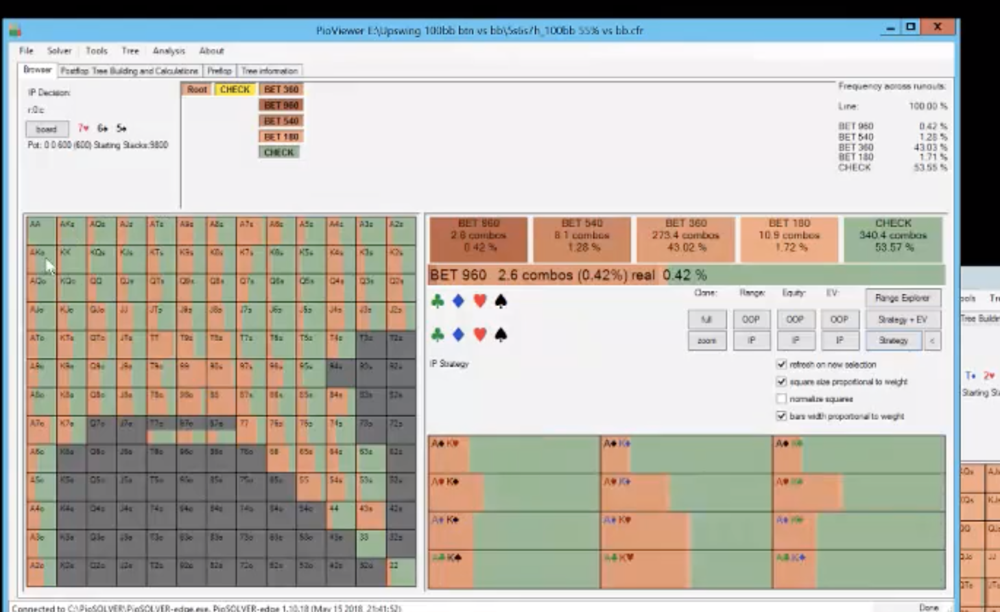
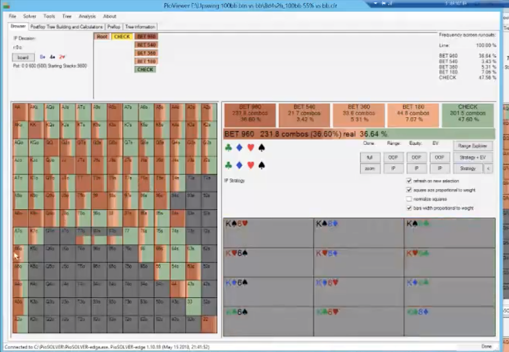

**9s7s3 flop BTN vs BB 100 effective with an ante 2.5 open**

This is the range for BB which is wide.

-notice that BB doesn't have TT+

---

- We check that flop interestingly with the backdoor draw and overs.
- we also check with the As card for BDFD value as well. Better to check that.

---

- good spot to check overpairs like KK and AA because they don't need the value from protection and don't want to get blown off their equity. Check the spadeless AA and KK because they can't take the heat. You can bet the KK or AA with the spade. spadeless is a pur check.
- bet smaller like 60% because the board is going to change a bunch, even IP.

---

- you can bet AK on these boards, but it's more of a bet if you have a blocker to the BDFD which is hearts here. If you have two backdoors, it's much more of a check.

---

**842r flop BTN vs BB effective with ante and 2.5 open**

- you can bet bigger here on low boards because BB doesn't have the top part of his range. Bet full pot or bigger. We can even do it with some 4s and some 2s. Bet smaller with 98 but bigger with A8.
- do bet smaller on this board with some hands that dominate his continues vs a small bet like AKs with BDFD or AKo. 98s is a small bet. You can bet small with A5s with a BDFD.
- opponent has to call with an 8 vs the top of our range like 99+ so betting big is good. this is another reason to bet big.

