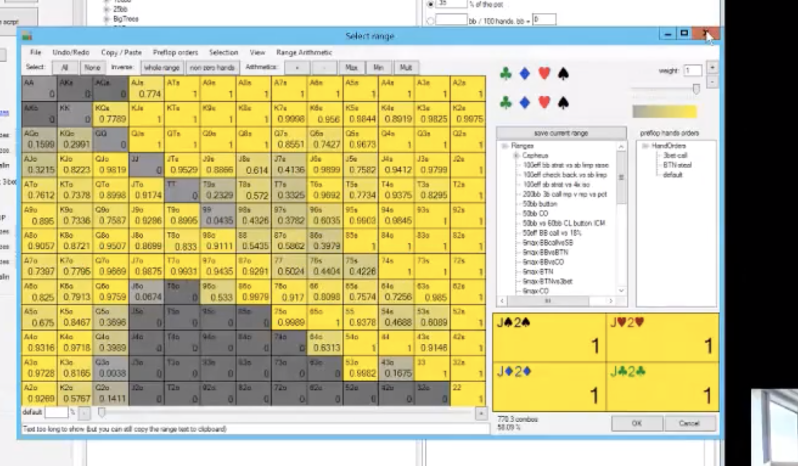
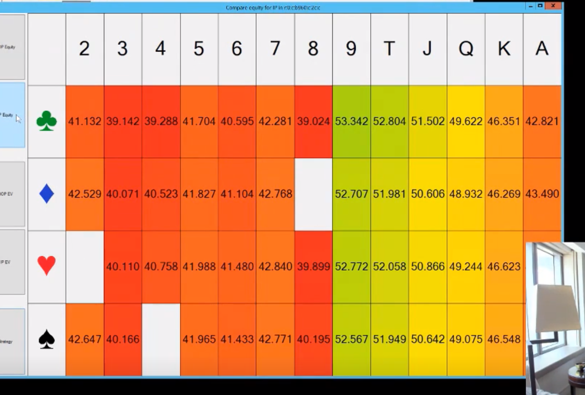

**cbetting turn**
- we bet flop, BB calls, and what next?

- on boards like 97s3s or JJ4 with a FD, the BB will often c/r with the top of their range so they might be capped on the turn.
- we do want to find no equity turn barrels, light value bets, and some light block bets with bluffs.
- overbet on turn cards that completely miss both ranges to make BB fold draws and low pairs.

**T83 monotone board BTN vs BB 100bb**
- BB doesn't have 99+ or AQ and doesn't have AJ a lot.

T83monotone, BTN should be a lot and with small amounts to take adv of wide BB range.

-BB can c/r Kh and the Qh bare with a 5 kciker. But BB will c/c KhJ or KhQ.
- BB is going to C/r Ah2 but c/c Ah9 because the 9 has more value.
- BB is going to c/r QhJ or QJh more than KhJ.

**4c turn brick**
- BTN can bet A5h, low heart, it's ahead of the BB c/c range with a Kh and it can charge the card too. Obv bet Ah5. Ah3 with a pair is a check apparently though. AhT with top pair is a check, ATo no FD is a bet.
- Still betting AhA
- BB has to fold or c/r Kh5c, same with Ah6c. Ah7c is mostly a c/r on teh turn if you continue or call, mostly c/r.
- for bb, all tens are another call, purely. gotta call again with a ten.

**overcard turn**
- lot more block betting.
- ace is a good card for IP because BB is c/r some Ah and has to fold a lot of aces, so equity wise the A turn is good for IP.

**4th flush card, say 9h turn. Board is T83hhh, 9h turn**
- we can pot or overbet our flushes with the bare AH, and hands that block his most likely flushes. J6dd is a good bluff because it blocks the BB single c/c flop range that might have a flush now. Since BB would c/c QhJ or QJh, J6dd is a good blocker to that even if it has no equity. More of a blocking game now.
- BB is c/c flop with KhJ or KJh and KhQ and QhJ and QJh and Ah9 and Ah8. So we need hands that block these and make them less likely. for IP K7ss without a heart blocks KQh and KJh and the 7 blocks some of the A high flushes. That's a good bluff card on a 4 flush. J6ss is also a good bet even though it seems like it has no heart and owuld not be good. What about QJss without a heart? I think it just doesn't block any Ah that much because I think AhJ is c/r. 96ss is a good blocker for Ah9 and Ah6.
- 75ss is probably the best bluff since it has equity and blocks two suited aces Ah7 and Ah5.

**KdQd6 flop, 1/3 pot bet**

- BB is going to c/r a lot of big hands.
- IP should bet pretty big with Jd9 JdT, AA, AK, 66, bottom two.
- lot of other hands 1/3 pot. A7ss with a BDFD, A3ss. balance with betting with K5 for IP. Ad4o is a bet because the 4 has no over but A8 with an over to the bottom is a check.
- vs a 1/3 pot bet, BB should be c/r A5dd with a NFD without an over to the bottom card but c/c A8dd but ATdd is a c/c mostly with the gutter. so the takeawy is the weaker suited aces are c/r. BB is c/c every queen and king vs a small bet. but KJss with a BDFD is a c/r sometimes. JTo with either diamond is a c/r sometimes. T9o with a diamond is even more of a bluff. Interestingly, 64o with a diamond is a c/r sometimes. JTo can call too but the ones that are sometimes a c/r are teh ones with a diamond.
- IP bets 1/3 pot, BB calls every queen and king. A5dd can be a call or a c/r. same with A4dd. 63dd is strangely a call. BB calls with weaker draws like T5dd more often than c/r. J9d is calling but Jd9 is c/r more often.

**KdQd6 flop, 1/3 pot bet flop, 2c turn**
- a 2 is a good card for IP to barrel again but it doesn't hit the BB c/c range which is any queen and king and low lfush draws. We might be able to barrel again with air. bet bigger too. our equity is worse but we can barrel them off their draws. we can also bet again on brick rivers if no flush. Strangely a brick is better than say a Jd and we have Ad6o because what matters more is that it misses his range. a 2-5c is best without the BDFD completing because that eliminates his turn continues vs people who say c/c A9ss on the KdQd6s flop. We can actually do some no equity bluffing there.
- So on KdQd6s, 2c turn, we can barrel turn with all T9 because it has gutshot and blocks KT and K9 and you can bet big with all suits. same with JT, T9, J9. A2o is also a big bet with bottom pair since it's a two pair blocker.
- IP can bet turn big with A4dd or A2dd with the two pair blocker, but checking back turn with J4dd and J8dd interestingly even 54dd on the turn. Checking back with that gutter with the FD, weird. J3dd is a bet because it blocks KJ which is nice, but 54dd is not a bet strangely because it doesn't block some of the stronger part of BB range... weird. I guess the idea is that we're betting so many diamonds already we just don't need to use this one as much. We're betting enough already with hands like T9o (with a diamond and without) that have blocks to KJ and K9 that we don't need to include 54dd with a gutshot and FD.
- For BB after a big turn bet, the bB has to fold all queens pretty much except QJ sometimes but not all the time. Q9 is a fold. All 6s are folds except for 65dd. top pair with the King for BB is almost a pure call.
- numbers that are interesting, OOP vs a small bet on flop has second pair on turn just as often as they have top pair.
- Interestingly, BB should fold QJ, QT, Q9 more oftan than Q7 because those higher queens blocks 9T and 9J which are our bluffs. Q8 is more of a call on turn than QJ.
- BB has to c/c again vs a big turn bet with A high FD still. fold all queens, even some kings. The fact that BB has to c/c again with A high FD, that makes barreling again with Ad5 a good play with NPND.

**KdQd6 flop, 1/3 pot bet flop, Ah turn**

- you can't overbet this card as well because it does hit BB a bit more. They have nut flush draws and sd. LJ has to bet smaller and not overbet as much.
- IP is going to bluff big with T and J and betting smaller with A5dd. and 43dd is betting bigger. A5dd is a smaller bet.
- we have an advantage on high card turns like a J an T because BB is c/r some of their gutters

**KdQd6 flop, 1/3 pot bet flop, 3d turn completing flush**
- you can still bet big with top pair and big hands because they retain vlaue vs the BB calling range on the flop. Not many flushes in BB relative to you.you can stil lbet 80% pot.

**842r, 4 turn**
- for BTN/IP, cbet KT with a BDFD, 9T with a BDFD, 96 with a BDFD is more of a check since it doesn't have two overs. KQs with a BDFd is a bet on flop for IP.
- AKo bets, but not AQ or AJ for balance. A2-A6o is a bet because it blocks A8. A6s is a pure check since it has two overs to the 2nd pair card. AT-AQs is a checkign a lot. AKcc without a BDFD is more of a bet.
- interestingly, aces check back this a lot. So if iP players bets twice, they may not have the ace as much here.

**8d4s2h rainbow BB play vs pot sized flop bet from BTN**
- BB can c/c KQ and KJ with a BDFD. ATo has to fold interestingly purely. only calls are AT-AQ with a BDFD. QTs and JTs are folds.
- BB interestingly is c/c with any 4 and any 2 with a BDFD and a little CR with 52s and 62s. sometimes the 2 without a BDFD folds. A9ss with a BDFD is a c/c from the BB vs a pot bet or even overpot bet. offsuit big aces are folding to a pot bet. A5o is a c/c or c/r. 76s with a BDFD is a call, without is a fold. 62cc without a BDFD is a raise or fold.
-BB can c/r with A5o and any A8 for top pair interestingly.

**8d4s2h, 3 turn rainbow BB play vs pot sized flop bet from BTN**
- doens't really matter if BB is capped. the card helps him and has lower portion of deck after your flop bet and thinned him out to just hands that connect with this flop and turn.
- overcards not so much.
- A 9c is a good card since he doesn't connect with a 9 that much. a Tc doesn't help much either. They are better cards than the A or K. BB can c/c with AJ and AT and A9 so has like 48 aces. CAnnot c/c with JT or AQ so only has AT really for 16 combos.
- equity chart showing that 9 and T are teh best cards to barrel, 8 is not:

**8d4s2h, 9 turn rainbow BB play vs pot sized flop bet from BTN**
- for LJ, A5 and A6 are good A high bluffs because they block A8 and A9. A5o has a wheel draw too and blocks his top pair.A3o too.
- LJ can bet everything pretty much and BB doesn't hit the 9.
- A2s is a bet. it blocks 2 pair with the 2 paired and the A blocks A8 and A9.
- the takeaway is that since the 9 hits so little of BB c/c range on flop, you can include some no equity bluffs. It's better than an A since BB could c/c with AJ.

**8d4s2h, Kd turn rainbow BB play vs pot sized flop bet from BTN**
- checking back 98 and 87 but betting A8 and Q8s.
-checking back 53s probably because it can bluff the river and we have so many value bets already and bluffs like 99+, any King, and bluffing with A5o and A3o,

**9s7s3d flop IP bets 80% pot**
- checking back 44-66. checking 43 and 63ss without the FD. all 3x is a check. 7s are checks too. A7s is a bet.
- T9 is a bet half the time, A9 a bet all the time. T9dd with  BDFD is a bet, other T9s is a check half the time.
- K7dd wit ha BDFD is a bet. 98dd is a bet mostly with a BDFD. AsAd is a bet with the spade.
- IP checks back AsJ off because it has value, but bets other aces.
- interestingly, AKss with a FD is a check 75% of the time. This is probably because we give up on this flop so much? AKdd with a BDFD is more of a bet.
- BB c/c with AJdd with the BDFD, folds other AJs, and actually c/c with AJss with the FD.
- BB can c/r FD like K8ss with the BD straight draw (BDSD). Q6ss is c/r half the time and QTss is c/c more often. Q2ss is c/r half the time. A2ss is not a c/r strangely but A6ss is maybe because it has BDSD outs too. ATss is a c/c. A8ss is a call though even though it as BDSD and K8ss is a c/r because it has BDSD and isn't good enough to call.
- so when we bet big, size down when flush overs or straights hit.

**Jh3c2h**
- BB can cr over card + FD, but c/c hands like 85hh with two unders and a FD. 86hh is mostly a c/c, 85hh can c/r a bit more with the BDSD. 65hh with a gutter is a c/r frequently but can still c/c. 65cc with a BDFD is a c/r. 54s without a BDFD or FD is a c/c half the time, with it's almost always. 54hh is so good that it doesn't really have an incentive to win the pot right now it's running so well. 52ss even without clubs or hearts can be c/r sometimes.
- BB c/r with 54o and 64o with a heart frequently.
- BB can laslty c/r Kh5 Ah5 wit ha heart.