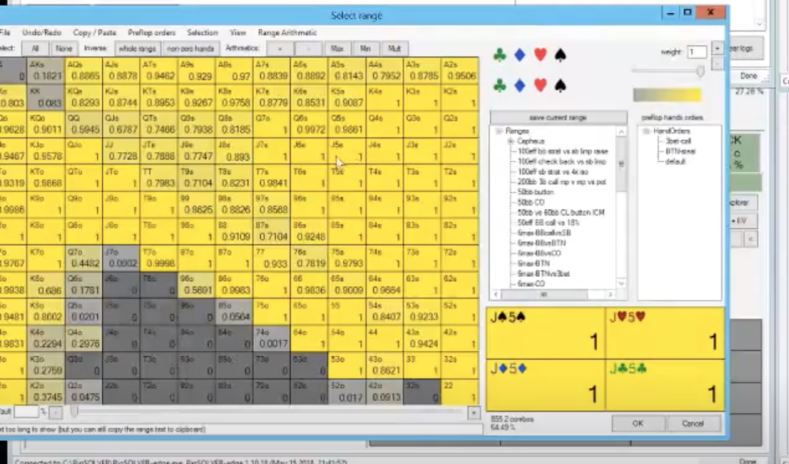
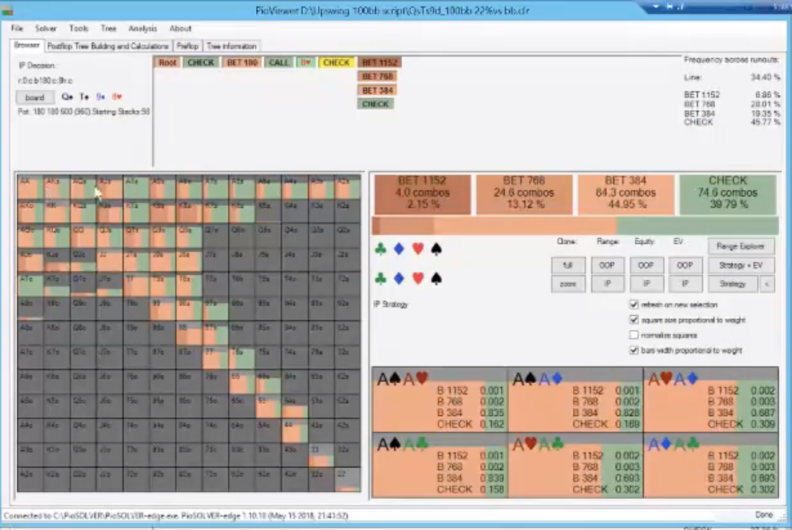

**QsTs9d board BB vs LJ 50bb**

bb range:

our LJ range with 50bb, 22%:

- our worst aces have a pair or gutter.

- on a 8 turn, we can bet small with something like AK again for 1/3 pot trying get BB To fold a bare 9 or T. This is our turn betting range:

- for the BTN vs BB, BTN gets to check more and bet a big bigger. BB doesn't have the top of their range anymore because they are 3 betting. BTN gets to size up more to 60%.

- big takeaway is that deeper you are at 100, AA is a fold on teh turn vs a CR on this flop and you can't play for stacks. the reverse odds are too big. Aces are a pure fold on the river but with 50bb, it's a call on the river if the board runs out. Very interesting. You can make bigger bets with 50bb on this flop because you're just not going to fold. Q9 and QJ with 50bb are pure calls but with 100BB on the river, it is not. Very strange.

-vs BB and if the BB is 3 betting big cards like all AJ and some KJs because reverse odds are less, then BTN can bet bigger because BB is lacking strong hands.

- on this QsTs9d board, you can cbet hands like 22-33, A2o, ATs OTB because the BB is defending so widely.
