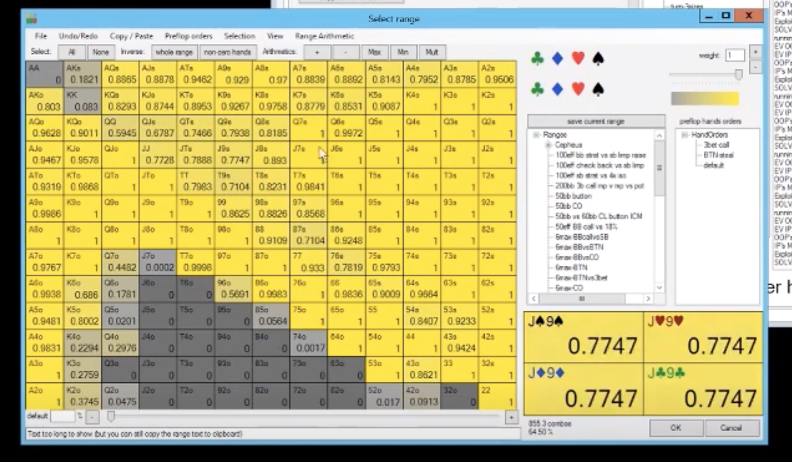

**c/r flop range, 100bb, LJ vs BTN**

once again, bb defend range:

-any pair, any suited, not Q7o all the time, K5o, any ace, QJs and QTs are 3 betting often.
- LJ opening this:

-ATo, any suited ace, not 22-33 always, 54s+, 97s+, J8s+, K7s+, not KJ and QJo always.

**Jh3c2h flop LJ**
-on the Jh3c2h flop, Lj is betting QTs, checking QTcc with the BDFD sometimes because it is a c/r heavy flop, betting pure bluffs.
- LJ betting Aht and ATh fairly big on this flop. Betting small with T9cc. Even 97ss is a bet, obv hearts but even the others. LJ is betting entire preflop range.

**Jh3c2h flop BB c/r. What can BB c/r with?**
- bb is more likely to CR JTcc than QJ. other JTs without a BDFD is a c/c. same with J9cc. it's a c/r to balance and for protection. KJ is a c/c because it needs less protection. AJ is a c/r because it has so much value. KJcc you can c/r sometimes.
- big draws can c/r. A4cc or A4hh can c/r. even without can c/r too. Q4hh can c/r too. it's high equity with the over.
- 96hh without the over is more of a c/c, but you can still c/r sometimes.
- low equity: 65cc is a c/r always. 65hh can do either. 65ss others can pure c/c. 64cc with a BDFD is a pure c/r. strangely 54cc is mostly a c/r, but can c/c too... makes sense it has more equity. 54ss without a BDFD and just a SD can do half. 53hh with a pair and FD can c/r mostly, can c/c too.
- 52cc with a BDFD is a pure c/r.
- bottom and third pair: 43s is a pure call, but 52s can c/r half the combos without a BDFD. 43hh with the FD can c/r half the time. 52cc with the BDFD is a pure c/r, the others are a c/f half the time. so with bototm pair you're c/r more.
- 64o, c/r the ones with any heart.
- OESD are a c/r half the time, if they have a heart c/r more often. if the OESD has BDFD like 54cc, c/r more often.
- lowest equity c/r. Kh5, Ah5. Kh5 is a c/r always, fold the others. Ah5 is way better, blocks the top pair and has a gutter and a bdfd.
- BB can c/r with 52cc with the BDFD. without is fine too.
- highest frequency c/r are AJ, especially with a heart. and JJ too because even though it's top set, lots of FD.

**Jh3c2h, LJ bets, BB c/r, LJ continues with?**
- super wide.
-pure call: every wheel ace like A2s and A4s even without a BDFD or FD. AQhh and AQcc is a call., all AA is a call. Even KhQ is a call with just two overs and a K high BDFD. TT is a pure call. even 44 is a pure call. KJo is a pure call with top pair. any ace high with Ah is a call interestingly. AhT no pair but a BDFD is a call.
- LJ can call with AKo with a heart, without it's a fold to a BB c/r., same with AQo. ATcc with a BDFD is a call too.
- folds, 98ss without a FD.

- cards we are most concerned about: flush completer (high and low are different), straight completer, top pair trips, bottom pair trips, overcard. BB has more flushes. How to play value hands when following turns come?

**Jh3c2h, LJ bets, BB c/r,**
- note that a lot of BB bluffs connect with bottom half of the board. gutshots, bottom pair, etc. BB when it c/r has A4o with the Ah, and 64cc.
- so when a low card comes 2-6, BB gets to bet big, excluding hearts for now.
- top trips is mostly a check from the BB, polarized strategy here.
- Ace is a good card for the c/r.
- BB equity is highest on 4,5,6,A:

- hearts help BB because the BB is c/r so many heart combos.

- IP is around 50% equity on the hearts which is why BB should block bet on th turn on hearts. bB has many hearts, but also a bunch of value bets that aren't flushes as well that BB wants to use small sizing OOP after c/r and get money in the pot with flushes later.

**Jh3c2h, LJ bets, BB c/r, call, 5d**
- BB bets 70% a lot. this card favors BB.
-BB keeps betting with K5hh with two pair and set blocker, K4hh with the straight blocker and FD, Q6hh blocks a straight. Even Ah5o with just secnd pair and no FD is still betting this turn because it hits us so hard and not LJ.
- QTcc is a check mostly without improvement. QJcc with top pair and check sometimes here and bet. mostly bet.

**Jh3c2h, LJ bets, BB c/r, call, 8h**
- BB is checking a lot.
- BB is betting again with Ah4 and Ah5. Ad4h with just a low 4 flush is often a bet. Ah6 is a bet too obviously with the nut 4 flush.
- 52cc just bottom pair is a check.
- our value hands like sets aren't worth enough to bet big. we can't just bet flushes big and sets and two pair small.equities are running too close to bet big. but we still want to bet because we have value hands. block bet saves us with two pair a bit and we can safelty fold because we are balanced. We don't want to check sets and two pair and face two bets. but you need to block bet with flusehs too about slighty less than 1/3pot.
- BB betting 1/3 pot with AJ and flushes. low flushes we bet bigger like 93hh.
- bluffs A8ss with just 2nd pair is a pot. A2cc is also a pot bet bluff. A3hh with the flush is a block bet or pot, A3ss as a bluff is a pot.
- bottom two with 32cc is a block bet at 600 into 2000.
- if you look a the EV grid pictures above... we big bigger more polarized on the 456 and since our ev goes dow nfor hearts, we incorporate more block bets. **That's why the hearts have block bets for BB... the equity is too close.**
- interestingly, the 2 keeps equity in the LJ favor since we just don't have that many twos that we're c/r. So even though it looks scary, it's not that scary.

**Jh3c2h, LJ bets, BB c/r, call, Kh**
- block bet flushes and vlaue hands. check 52. bet small with AhJ. even KK is a bet to balance.
- since we have a lot of value hands that we want to protect but still want to eek value, this is the only turn to block bet. We can block bet flushes and our sets and FH and get in money later.

**Jh3c2h, LJ bets, BB c/r, call, 3**
- bet big with FD, keep going with A4 and A5 with the gutter, give up with K5cc. Ah7 is giving up.

**Jh3c2h, LJ bets, BB c/r, call, Qd**
- you can bet, but not as frequently because it hits both ranges equally.
- BB checks AJ more often.
- still betting big. lot of our range retains equity.