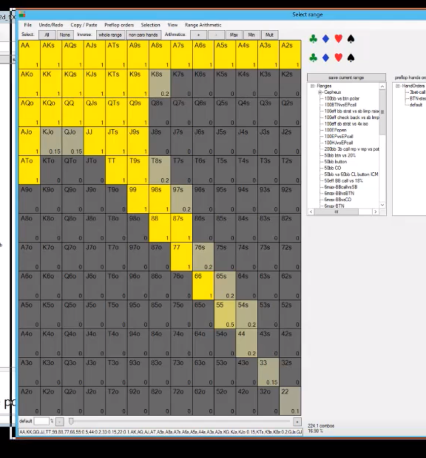
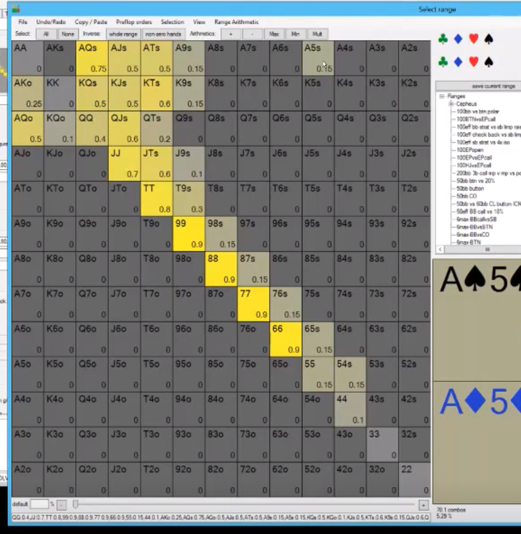
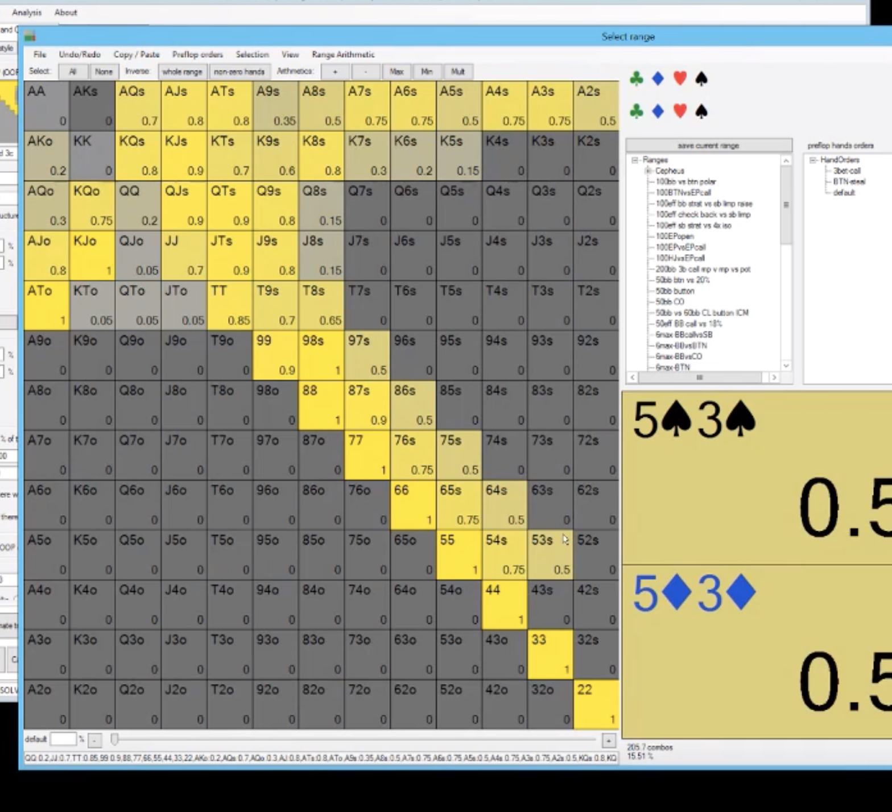

**cbetting frequency OOP**
- so UTG 8-ish is this:

IP caller but still early:

- AQ flats a lot. JJ calling even more often.
- A5 adn A9s are 3 betting as bluffs.
- KQ a fold. K9s 3 betting sometimes. KT and KJs are 3 bets as bluffs sometimes. AK flats sometimes.

- the IP person has like 5% of hands, OOP haev 17% of hands. OOP cannot bet as frequently or put too much money in the pot.

**9s8d2d flop EP vs EP**
- OOP has a pure check. has to check everything. Makes sense. Too many high cards.
- IP calls with A5dd. JTo is a raise half the time, JTdd even more. IP can raise 66 vs a small bet and 77. KTss and KTdd can be raised. AQdd can be a call.
- if BB checks, IP checks with AQo. AQ and AK with any BDFD is more of a bet. AJo with no backdoors are checking more than the ones with backdoors.
- OOP will c/r with A3dd smsall FD and c/c with AQdd the big flush draws to keep lighter hands in the pot. AKdd are a c/c, AQdd is slightly more of a c/r but still a c/c. AA can c/r with the diamond. 67ss and 67dd are c/r too. AdT is c/r too. QTo and QJs can c/r or c/r. QJdd and QJss are 60/40 c/r. IP has to fold KTss with the BDFD. IP KTss goes from a raise to a b/f. takes IP off equity from BD and overs. IP folds 55-77 too which b/f.
- if someone bets on this, you can raise KT, KJ AQdd with the FD or BDFD, we don't want to call because they ahve equity hands that need to fold.
- if OOP checks, IP checks back AQ and AK and AJ.

Playout:
- if OOP checks, IP bets, OOP can cr low A-high FD, c/c with AQ and AJdd, c/r KTdd, c/r AdJ. - QTss with the BDFD can c/r sometimes. QJhh can c/c.
- IP now has to fold their KJ with the BDFD which would bet the flop. IP is betting  ATs Kts with the FD and BDFD and AQo. and ATs with no pair

On the turn:
- the c/r can bet big on the low cards and A and K high.

Takeaway:
- OOP should check more on this flop vs people who raise with gutters and BDFD. If opponent is raising KJs with FD and BDFD and JJ and AdQ, then we should check everything on this flop and have a c/r range.
- instead of cbetting into a condensed range that always continues, try c/r.

**9s8d2d flop EP vs EP, OOP cr, IP calls, turn Qs**
- IP can call with with AJss with the BDFD.
- OOP can check range, eve nwith JT. OOP has too many weakish hands like top pair or second pair or bare A highs that it needs to check big hands OOP to protect. QTdd is a check,  even A6dd is a check.
- most of IP's FD are checks because if they bet 1200 and ge tc/r to 4600, they have fold 76dd and lose equity.76hh is a good bluff though. ATdd is also a checkback.
- if OOP checks again after the flop c/r, IP will check back FD and bet the SD because IP doesn't want to get blown off the FD. for IP lots of the FD are checks, almost always with NFD because OOP might c/r again.
- if the river is a 4d, and the turn goes check, bet, call. OOP checks river, IP can't even bet some straights on the river

**9s8d2d flop EP vs EP, OOP cr, IP calls, turn Td**
- OOP bet again with flushes, AA with the Ad. By betting flushes 40%, we can bet AdA again. OOP bluffs with AdQs with a 4 flush.
- AdT is a check
- because we have so many flusehs in our c/r range, we can linear bet and bet flushes and our mid range hands.
- takeaway is that OOP is mostly checking.

**6s4d3cr flop EP vs BTN**
- btn range:

- OOP has 50% equity.
- but lower EV because the strategy that OOP has to take is transparent and gives away the pot a lot. The overpairs will have to check a lot of turns.
- all the Ace and K high while having hig equity, will get blown off of it. they will never realize the equity and have low EV.

- OOP has to fold AQ, AJ pure AK half the time to big bets once OOP checks.
- A7s and A6s are c/c. A7ss can c/r.
- OOP can c/c here with KK-AA.
- IP bets small here in real lief with a 4 or a 3 or AQ with a BDFD so in response, it's good for OOP for c/r here.
- if IP bets big, OOP has to fold a lot of overs. if IP bets small, you can c/c with some overs. vs small bet, OOP can c/r AA and KK, c/c with AJ-AK, and c/c more with A6 and A4 and A7 than c/r. KJss with the BDFD can c/r.
- what should IP be bluffing with when checked to? 3 properties:
  - they have strong BD equity
  - they have blockers to opponent value range.
  - folds out hands that dominate it. K7ss can fold out KQ and A8.
  - For ex: blockers to OOP value range. K7ss has BDFD, blocks KK, folds out hands that dominate it.

  Theory:
  - when people bet polarized into you (you think they are polarized), put in
  less money with light holdings. use strongest holdings to bluff catch. and with weakest, make them fold with hands that don't block thier bluffs and block thier value hands. Ex, vsa big bet, c/c with AA. We can fold weak holdings that block their bluffs.

- IP is betting big here with pair + draw, but also hands like KJ and QJ with the BDFD and KJo. and ATo is a bluff with little back door equity but they block the nuts.

**6s4d3c flop EP vs BTN, OOP checks, IP bets small, Ah turn**
- IP bets big on A, K, Q because IP no longer has to protect middle hands (because they've been outdrawn and will check). So IP will bet big with strongest hands and best bluffs.
- The A is the worst card equity wise because OOP is calling with a lot of aces, and so that kind of implies that we can bet big and polarized. IP will have two pair because IP will bet small on flop with A3 and A4ss.
- IP will check AQ and AJ to balance. no blocking to OOP slowplays and no redraws so will have to c/f to a c/r.
- 53ss is a big bet to get middle pocket pairs to fold. 86ss is more of a bet than AQo which is interesting.
**- IP is checking and giving up with QTs and KTs I guess because a lot of OOP range is A highs and they have no draws.**

**6s4d3c flop EP vs BTN, OOP checks, IP bets small, 9h turn**
- hearts are good for IP to bet small again with most vulnerable hands and check hands like AQ and AJ. those big bway still dominate OOP hands that c/c which are also bways. If they bet again, OOP is still c/c any pair. KJss can block bet bluff to fold out A highs.
**- ip is still betting kj and KQ and QT and checking AQ and AJ. KQ and KJ and qT can get better hands to fold now, unlike the Ah turn.**